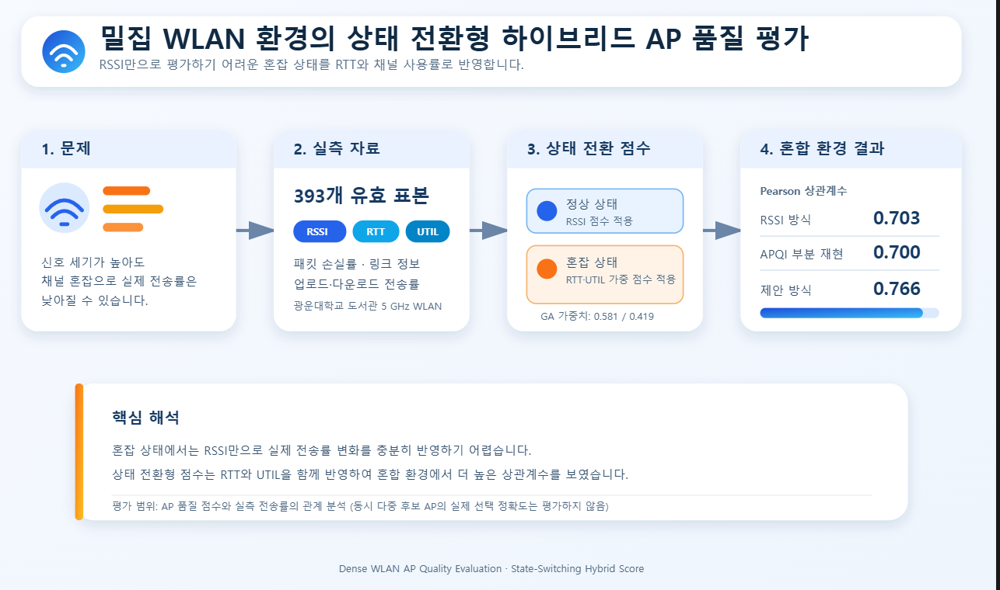
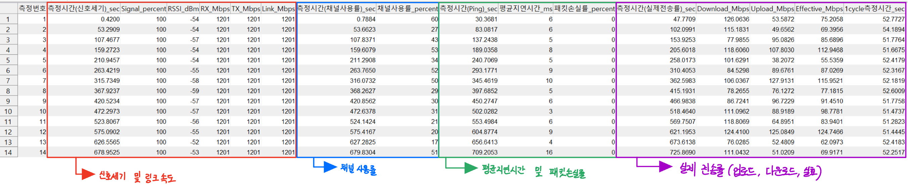
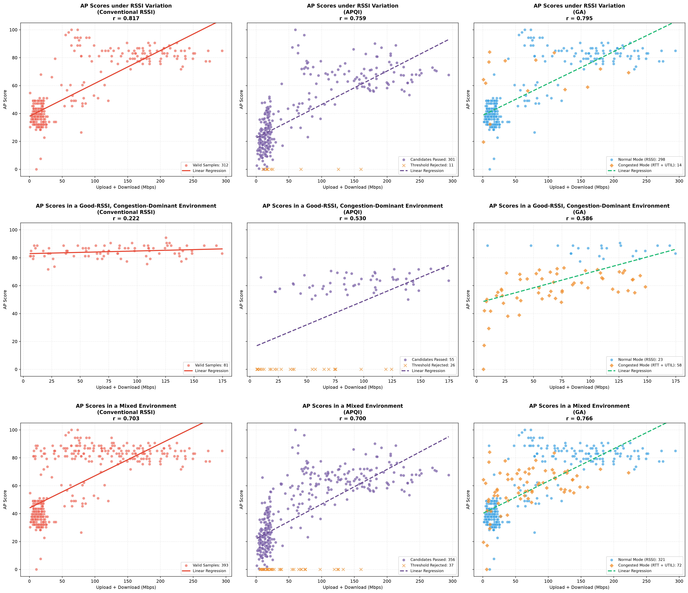

# 밀집 WLAN 환경에서 통신 품질 향상을 위한 상태 전환형 하이브리드 AP 품질 평가

> RSSI 단독 평가의 한계를 보완하기 위해, 정상 상태에서는 RSSI를 유지하고 혼잡 상태에서는 RTT와 채널 사용률을 반영하는 AP 품질 점수 평가 프로젝트입니다.

---

## 1. Project Overview

### 프로젝트 목표

밀집 wireless local area network(WLAN) 환경에서는 신호 세기가 높은 access point(AP)라도 트래픽과 채널 경쟁이 집중되면 실제 전송 성능이 낮아질 수 있습니다. 본 프로젝트는 이러한 한계를 완화하기 위해 **상태 전환형 하이브리드 AP 품질 점수**를 구성하고, 실측 전송률과의 관계를 분석합니다.

정상 상태에서는 기존 received signal strength indicator(RSSI) 기반 점수를 적용하고, 혼잡 상태에서는 RSSI를 제외한 round trip time(RTT)과 channel utilization(UTIL)의 가중 점수를 적용합니다. RTT와 UTIL의 가중치는 유전 알고리즘(genetic algorithm, GA)으로 탐색합니다.

<p align="center">
  
</p>

### 문제 정의와 제안 방식

| 구분 | 내용 |
|---|---|
| 문제 | RSSI가 높더라도 AP 또는 채널이 혼잡하면 실제 전송률이 저하될 수 있습니다. |
| 제안 | RTT·UTIL로 상태를 판정하고, 정상·혼잡 상태에 따라 AP 평가 점수를 전환합니다. |
| 평가 | AP 품질 점수와 실측 업로드·다운로드 전송률 합 간 Pearson 상관계수를 비교합니다. |

### 주요 입력 및 출력

**Input**

- RSSI, 링크 정보, UTIL, RTT, 패킷 손실률
- 업로드·다운로드 전송률
- 광운대학교 도서관 5 GHz WLAN 환경에서 수집한 393개 유효 표본

**Output**

- 정상·혼잡 상태별 하이브리드 AP 품질 점수
- RTT·UTIL 최적 가중치: `0.581 / 0.419`
- RSSI 방식, APQI 부분 재현 방식 및 제안 방식의 상관계수 비교 결과

### 핵심 결과

제출본의 혼합 환경 전체 자료 적합 결과에서 제안 방식의 Pearson 상관계수는 **0.766**으로, RSSI 방식의 **0.703** 및 APQI 부분 재현 방식의 **0.700**보다 높게 나타났습니다. 다만 이 결과는 전체 자료로 가중치를 탐색하고 평가한 결과이므로, 수정 분석에서는 세션 단위 홀드아웃 검증으로 일반화 성능을 별도로 확인합니다.

> **연구 범위**  
> 현재 데이터셋은 각 측정 세션에서 연결된 하나의 대상 AP를 기록합니다. 따라서 이 저장소는 AP 품질 점수와 실측 전송률의 관계를 평가하며, 여러 후보 AP 중 최적 AP를 선택하는 정확도를 주장하지 않습니다.

---

## 2. 측정 기록 형식

각 표본은 신호·링크 정보, 채널 사용률, Ping 기반 RTT·패킷 손실률, 실제 업로드·다운로드 전송률 순으로 수집했습니다.



측정 세션의 위치, 대상 AP 영역, 측정 상태 및 표본 수는 [docs/measurement_sessions.md](docs/measurement_sessions.md)에 정리했습니다.

---

## 3. 데이터셋

통합 워크북은 총 400개 원시 표본으로 구성됩니다. 누락 값이 있는 5개 표본과 측정 오류로 확인된 2개 표본을 제외하여, 제출본 분석에는 393개 유효 표본을 사용했습니다.

| 환경 | 유효 표본 | 정상 | 혼잡 |
|---|---:|---:|---:|
| RSSI 변화 환경 | 312 | 298 | 14 |
| RSSI 양호·혼잡 우세 환경 | 81 | 23 | 58 |
| 혼합 환경 | 393 | 321 | 72 |

혼잡 우세 표본은 오픈열람실 2 AP 영역에서 혼잡 조건을 구성하여 수집했습니다. 정확한 혼잡 유도 절차는 논문 수정 과정에서 검증 중입니다.

---

## 4. 방법

### 상태 판정

제출본에서는 다음 중 하나를 만족하면 혼잡 상태로 분류합니다.

```text
RTT >= 22 ms 또는 UTIL >= 56%
```

이는 보편적인 WLAN 임계값이 아니라, 해당 실험 환경과 데이터에서 도출한 운용 임계값입니다.

### 하이브리드 점수와 가중치

```text
정상 상태: Score = 정규화된 RSSI
혼잡 상태: Score = w_RTT × 정규화된 RTT + w_UTIL × 정규화된 UTIL
```

RTT와 UTIL은 원시 값이 낮을수록 더 높은 품질 점수가 되도록 변환합니다. 제출본의 전체 자료 적합 결과는 다음과 같습니다.

```text
w_RTT  = 0.581
w_UTIL = 0.419
```

GA의 적합도는 하이브리드 AP 점수와 업로드·다운로드 전송률 합 간 Pearson 상관계수입니다. 0.001 간격 전수 탐색에서도 동일한 최적값이 확인되었습니다. GA는 핵심 기여라기보다 오프라인 가중치 탐색 절차로 해석합니다.

---

## 5. 제출본 결과

| 환경 | RSSI | APQI 부분 재현 | 하이브리드 점수 |
|---|---:|---:|---:|
| RSSI 변화 환경 | 0.817 | 0.759 | 0.795 |
| RSSI 양호·혼잡 우세 환경 | 0.222 | 0.530 | 0.586 |
| 혼합 환경 | 0.703 | 0.700 | 0.766 |

값은 품질 점수와 실측 업로드·다운로드 전송률 합 간 Pearson 상관계수입니다. 전체 자료 적합 결과는 추적성을 위해 보관하며, 독립적인 일반화 성능으로 해석하지 않습니다.



---

## 6. 수정 현황 및 한계

논문은 현재 수정 중이며, 이후 분석에는 다음을 포함할 예정입니다.

- 세션 단위 홀드아웃 검증: 학습 세트에서만 가중치·임계값·정규화 범위를 결정
- 임계값 민감도 분석
- 상태 전환 없는 선형 점수 및 완만한 상태 전환 방식과의 비교
- RTT·UTIL 가중치의 bootstrap 안정성 분석
- APQI 부분 재현 범위와 측정 절차의 명확한 문서화

주요 한계는 다음과 같습니다.

- 현재 데이터셋에는 동시에 관측한 복수 후보 AP 집합이 없습니다.
- 한 개 실내 도서관 건물, 한 대의 노트북, 5 GHz WLAN 환경에 한정됩니다.
- 제출본의 전체 자료 결과는 학습과 평가가 중복되므로, 일반화 성능의 단독 근거로 사용할 수 없습니다.

---

## 7. 저장소 구조

```text
.
├── src/                    # 재현 가능한 핵심 분석 코드
├── data/                   # 통합 측정 워크북
├── results/
│   ├── figures/            # 생성된 그림
│   └── tables/             # 생성된 CSV 결과
├── assets/                 # README용 시각 자료
├── docs/                   # 세션 요약 및 프로젝트 문맥
├── paper/                  # 제출 논문 및 심사 문서
├── requirements.txt
└── README.md
```

---

## 8. 재현 방법

```bash
python -m venv .venv
.venv\\Scripts\\activate
pip install -r requirements.txt
python src/final_ga_analysis.py
```

스크립트는 `data/HOPE_측정자료_상황별정리.xlsx`를 읽고, 분석 산출물을 `results/`에 저장합니다.

---

## 9. 자료 안내

- 현재 논문과 심사 문서는 수정 이력 관리를 위해 `paper/`에 보관합니다.
- 제3자 저작권이 있는 참고문헌 원문은 이 저장소에 포함하지 않습니다.
- 원본 측정 스크린샷은 저장소 외부에 보관하며, 문서화를 위해 측정 기록 형식 이미지 1장만 포함합니다.
